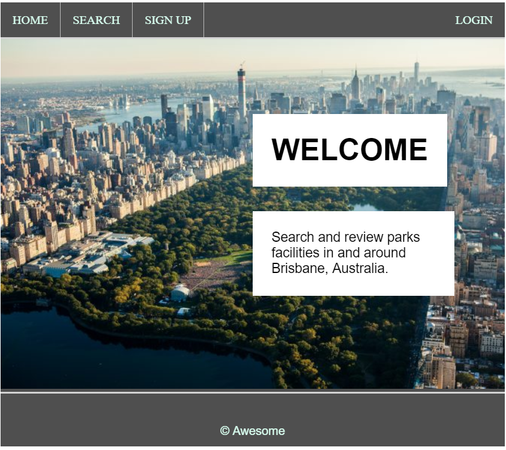
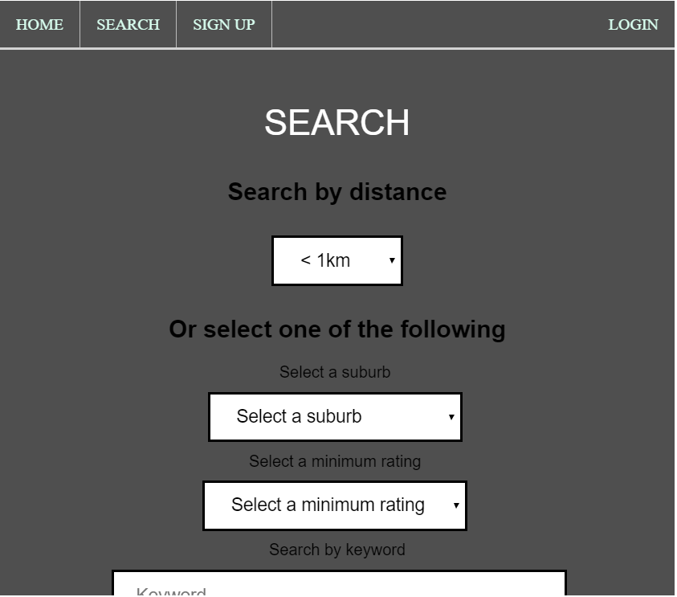
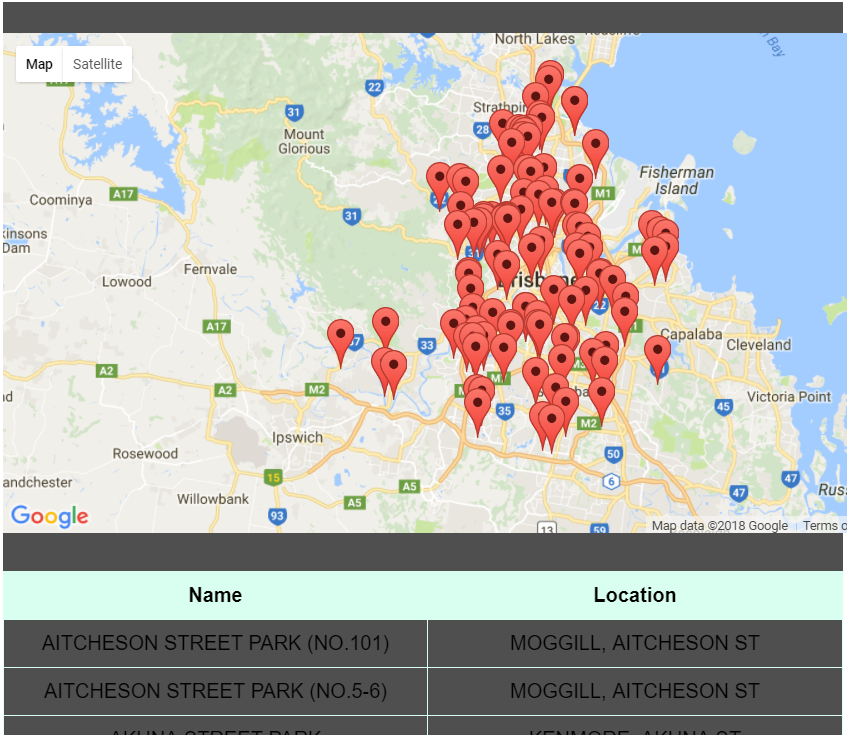
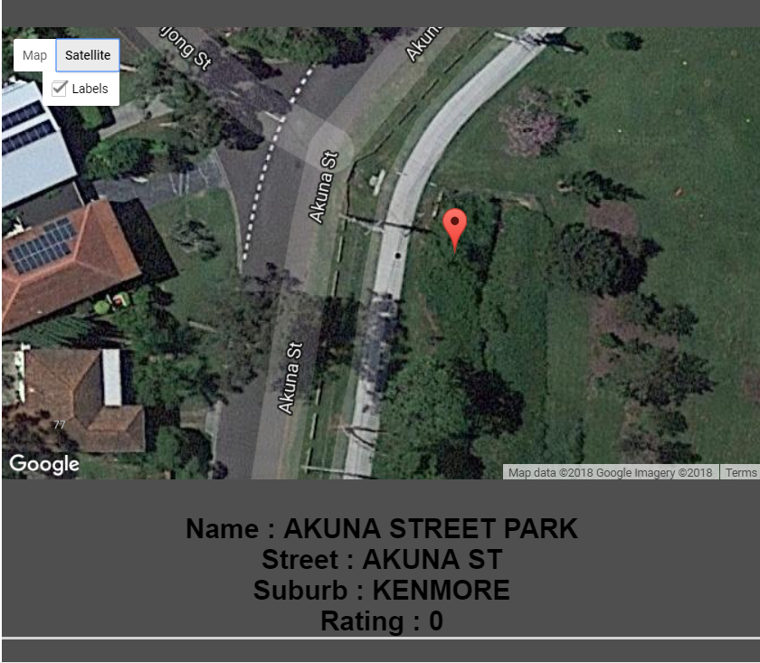

# Parks

# The Project
The Project was to build a website for people to find parks facilities in and around Brisbane, Australia.
The website would allow a user to search for a park in 4 ways, by name, by suburb, by rating and location radius,
users would also be allowed to sign in and rate parks with a star rating.

# Criteria and Framework
We were not allowed to use any framework such as bootstrap or any premade CSS stylesheet, we were allowed
to use google maps and its API for maps building and tracking. The project was build with PHP and
some javascript and html and css.

# Demo
http://165.227.71.5/

# Screenshots

